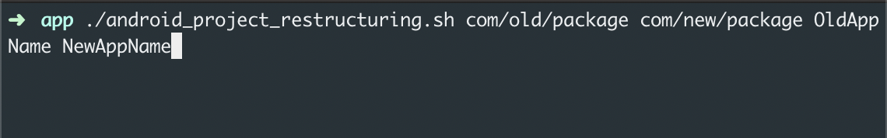

# Android project restructuring

### Aim

Changing the package structure of the Android project. 

### Arguments

1. Old package name (Eg: com/old/package)
2. New package name (Eg: new/package/name)
3. Old app name     (Eg: OldAppName)
4. New app name     (Eg: NewAppName)

### File and Folder getting effected

##### Changing package folders

If the old package name is `com.package` and new package name is `com.newpackage` then the script will change the folder `package` into `newpackage` in the following places.

`main/`

`test/`

`androidTest/`

#### Changing package name

Package name will be changed in the following files.

`AndroidManifest.xml`

`build.gradle` (app)

#### Changing app name

App name will be changed in the following file.

`values/strings.xml`

#### Running the script

Place the script on the top level of the project, same level as the `app` folder.

#### Upcoming

1. Support for Android flavours.s
